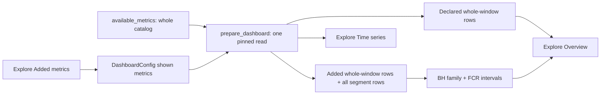

# Explore overview, added exploratory metrics, and one exploratory family

Kata: `qrsh`. Branch: `beautiful-marimo-notebooks`.

## Goal

Explore opens on a whole-window relative-lift overview of every experiment
metric, optionally broken out by a declared breakout. The analyst can add
metrics from the saved definitions that the experiment does not declare. Every
exploratory comparison on the overview is corrected as one Benjamini-Hochberg
family. The current trajectory view remains available as a **Time series**
mode.

## Non-goals

- Querying the warehouse after `prepare_dashboard`. Every tab still reads one
  pinned source operation (review 6457).
- Changing any declared metric's confirmatory estimate, interval, verdict, or
  family selection.
- Promoting an added metric to a declared role. An added metric is chosen
  after data are visible and is never confirmatory.
- Raw warehouse columns without a metric definition. "Available metrics" means
  metrics in the loaded `Definitions`.
- Correcting the Time-series mode across metrics. Its segment lines keep the
  declared view multiplicity and remain pointwise over time.

## Components

The work lands in three ordered parts. Each part is independently testable.

### 1. Library: added metrics in the estimators

- `Analysis.available_metrics` (definitions-backed only) returns the saved
  per-unit metrics on the experiment's unit that the plan does not declare, in
  definitions order. Report-only `total`/`active` metrics and metrics of
  another entity are not offered.
- `run`, `run_breakout`, `run_asof_lift`, `run_asof`, and `run_daily` accept
  an `exploratory_metrics` argument naming metrics from `available_metrics`.
  Their rows carry `role="exploratory"`, compile the same unassigned default
  procedures `_daily_lift` already compiles, and never enter the headline
  family or alter a declared row.
- `readout_snapshot` and `dashboard_snapshot` pin the added metrics' fact
  sources with the declared ones, so they read from the same pin.
- Refusals:
  - an unknown name, or one already declared, refuses before any query with a
    new stable code under `facade.analysis_config`;
  - every non-definitions ingress path refuses `exploratory_metrics` with one
    shared source-limited code naming `Analysis.from_definitions` as the
    route forward;
  - existing per-capability refusals (for example dimensioned `run_daily`
    for an undeclared metric) keep their codes.
- The parity harness gains a case covering all six ingress paths: supported on
  `from_definitions`, refused with the shared code elsewhere.
- `docs/limitations.md` gains the row for this capability.

### 2. Library: one exploratory family

- `select_exploratory_family(rows, *, q)` in `increment.estimation.family`
  takes whole-window `LiftEstimate` and segment `BreakoutEstimate` decision
  rows and returns them with BH discovery flags over the whole set and
  FCR-adjusted intervals (Benjamini-Yekutieli) on selected cells. It rebuilds
  each row's decision evidence from the row's persisted sufficient statistics
  and reference, and reuses `bh_select` and the existing FCR re-estimation;
  selected intervals equal `run_breakout(correction="bh")` for the same inputs.
- A row whose interval cannot be reissued exactly from persisted state
  (quantile, percentile-winsorized set, additive-scale, non-ITT, missing
  statistics) is excluded. `exploratory_family_exclusion(row)` names the reason,
  so a caller can leave such cells out instead of refusing the family.
- Segment hypotheses are keyed by dimension, segment value and source, so two
  breakouts of one property from different sources are separate hypotheses.
- Each returned row records `family_axes`, `family_q`, `family_size`, and
  `discovery`, so a row read alone states which family corrected it.
- Inputs must be uncorrected decision rows: pre-corrected, sensitivity,
  sequential and informative-prior rows are refused. The uncorrected segment
  rows come from `DashboardBreakoutReads.uncorrected_segments`, a breakout read
  with no view-multiplicity correction.

### 3. Dashboard

- `DashboardConfig(exploratory_metrics=(...))` names the added metrics shown,
  validated against `available_metrics` before preparation. The exploratory
  family counts every offered metric whether shown or not; a source with no
  saved definitions offers none.
- `prepare_dashboard` reads every offered metric inside the same pinned read
  and captures, once per snapshot:
  - the declared whole-window rows (the existing headline rows, unchanged);
  - uncorrected whole-window rows for every offered metric;
  - uncorrected segment rows for every declared and offered metric, every
    declared breakout, and every non-control arm, through
    `DashboardBreakoutReads.uncorrected_segments`;
  - the exploratory family over the offered metrics' whole-window rows and all
    segment rows, computed by part 2; offered-but-hidden metrics contribute
    cells but no displayed rows.
- The Explore tab gains a mode switch, **Overview** (default) and
  **Time series** (the current view). **Compare by** applies to both.
- The overview is one native CoefTable, matching the Readout: groups Primary,
  Secondaries, Guardrails, Added; each metric's whole-experiment row first,
  its segments nested beneath when **Compare by** is not Whole experiment; a
  shared forest axis; the existing interval and data inspector.
  - Declared whole-experiment rows render the Readout rows verbatim, labelled
    "as in Readout": their declared roles and corrections stand, including the
    secondaries' own discovery family.
  - All other rows are exploratory and show their family-corrected interval.
    Only discoveries are coloured; other intervals are unadjusted and drawn
    neutral even when they exclude zero.
  - Notes state the family: BH at the plan's `q` across N comparisons.
- Because the family is fixed per snapshot, switching **Compare by** never
  changes a cell's interval or discovery flag.
- Added metrics also appear in Time series wherever the engine supports them;
  unsupported states show their coded refusal, as today.
- Added metrics are chosen inside Explore. `render_dashboard` returns a marimo
  anywidget hosting the dashboard page; the page's **Added metrics** control
  sends a new selection to Python, which prepares a new snapshot and replaces
  the page, reopening Explore. A refused or failed preparation keeps the
  current snapshot and restores the selection.
- Post-hoc selection: the family is the whole offered catalog, fixed before
  anything is shown, so choosing what to display (or stopping once something
  looks significant) never changes the correction. A new preparation reads
  the warehouse afresh; a later read on more data is a new look, not part of
  this family. A static export cannot change the selection.

## Method interactions

| Combination | Classification |
|---|---|
| CUPED, ratio, winsorized added metrics | Supported; the same estimators as declared metrics. |
| Clustering | Supported for whole-window cells. Segment cells are source-limited: definitions refuse clustered experiments with breakouts (`definition.validate_experiment.declares_cluster_alongside`), so no clustered segment cell exists. Day-axis states keep the existing clustered refusal. |
| Breakouts | Supported for every declared breakout; added metrics use the same breakout definitions. |
| Informative prior on a cell | Mathematically unsound for BH (no frequentist p-value); that cell is refused with the existing `breakout.run_breakout_bh_excludes_prior` code and excluded from the family. |
| Sequential inference (always-valid or registered) | Unfinished: the exploratory family refuses with a new coded refusal and a kata issue; declared rows still render. e-BH over arbitrary segment cells needs its own validity argument. |
| Multiplicity roles | Declared roles keep their compiled families; added metrics carry `role="exploratory"` only. |
| Non-definitions ingress paths | Source-limited: no saved definitions to add from. |

## Data flow

## Testing

Unit tests use real DuckDB fixtures, never mocked estimators.

- Library part 1:
  - an added metric's rows equal the rows for the same metric declared as an
    exploratory metric in the plan;
  - declared rows are identical with and without added metrics;
  - each refusal code, raised before any query;
  - the ingress parity case.
- Library part 2:
  - BH flags and FCR intervals equal `select_family` on known p-values,
    including ties at the threshold, an empty family, and a family of one;
  - refusal of pre-corrected and non-p-value rows;
  - pickle and deepcopy round trips of the refusals.
- Dashboard:
  - declared whole-experiment overview rows equal the Readout rows;
  - the family size and each cell's interval are independent of
    **Compare by**;
  - the family and every shared cell are identical whatever is shown, and the
    extended warehouse-mutation test shows added metrics come from the pinned
    read;
  - prior and sequential refusals render per row;
  - the widget re-prepares for an added metric, keeps a refusal's snapshot and
    selection; a browser smoke of the Explore picker, the static-export
    message, both modes, and the Report remaining unchanged.

## Documentation

- `docs/guides/dashboard.md`: the overview, added metrics, the exploratory
  family and its labels, and the Time series mode.
- `docs/limitations.md`: the ingress row and the sequential refusal.
- API reference for `available_metrics`, `exploratory_metrics`, and the
  family function.
